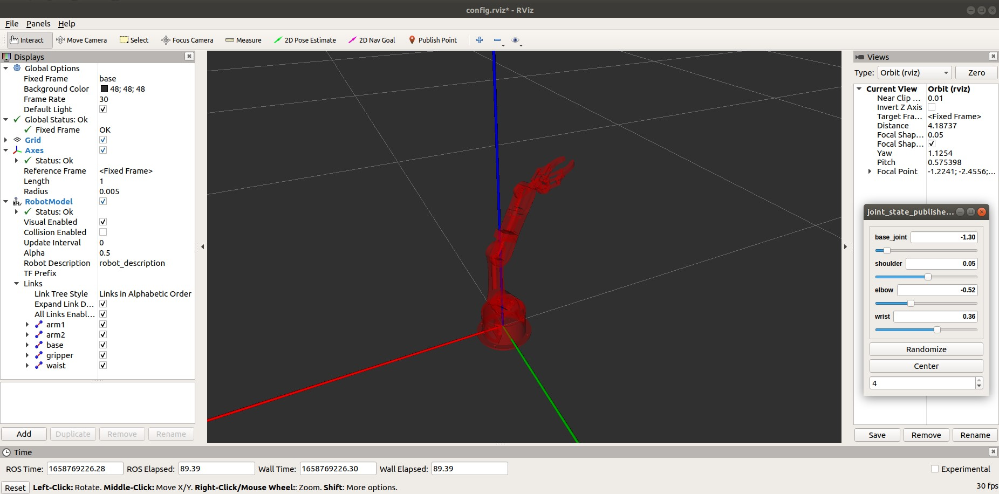

# Installing and configuring arm package on ROS

## Overview:

These tasks is completed by [Nada Oteif](https://sa.linkedin.com/in/nadaoteif) as a part of [Smart Method](https://s-m.com.sa/en/index.html) for Summer training in 2022 at Robotics and AI track.

## Description:

After installing ROS in Ubuntu you need these steps to install arm package:

1. Create a workspase with Catkin:
```
sudo apt-get install ros-melodic-catkin
mkdir -p ~/catkin_ws/src
```

2. Go to the workspase ```cd ~/catkin_ws```

3. Install the package of workspase using:
```
catkin_make //to compile the package

cd ~/catkin_ws/src

git clone https://github.com/smart-methods/arduino_robot_arm.git
```

4. After clone the packge go back ```cd ~/catkin_ws```

5. Then, run this instruction inside your workspace based in your ubuntu copy to install all the dependencies:

```
rosdep install --from-paths src --ignore-src -r -y

sudo apt-get install ros-melodic-moveit

sudo apt-get install ros-melodic-joint-state-publisher ros-melodic-joint-state-publisher-gui

sudo apt-get install ros-melodic-gazebo-ros-control joint-state-publisher

sudo apt-get install ros-melodic-ros-controllers ros-melodic-ros-control
```

6. Go to bashrc folder and do the following:

on terminal,
```
sudo nano ~/.bashrc

// at the end of the (bashrc) file add the follwing line:

source /home/nada/catkin_pr/devel/setup.bash

//after that click on ctrl + o then ctrl+ x to back to terminal and type 

source ~/.bashrc
```

--------------------------------------------------------------------------------


## Configuring Arduino with ROS

- Install Arduino IDE in Ubuntu https://www.arduino.cc/en/software then to install run ```$ sudo ./install.sh``` after unzipping the folder.
- Launch the Arduino IDE
- Install the arduino package and ros library 


--------------------------------------------------------------------------------


## Simulation

### Controlling the robot arm by joint_state_publisher


```$ roslaunch robot_arm_pkg check_motors.launch```




You can also connect with hardware by running:

```$ rosrun rosserial_python serial_node.py _port:=/dev/ttyUSB0 _baud:=115200```


### Controlling the robot arm by movelet & gazebo
```$ roslaunch moveit_pkg demo_gazebo.launch```


--------------------------------------------------------------------------------


## Connecting with Arduino 

```
$ roslaunch moveit_pkg demo.launch
$ rosrun rosserial_python serial_node.py _port:=/dev/ttyUSB0 _baud:=115200
```


